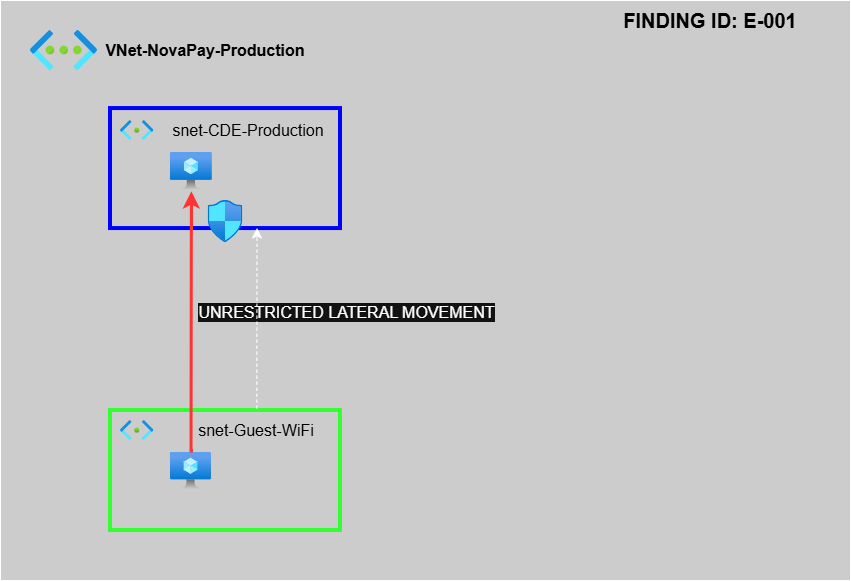

🛡️ GRC Consultant Daily Log: Infrastructure & Visualization
Log Diario del Consultor GRC: Infraestructura y Visualización

Date: February 02, 2026 Consultant: Felipe González Arcos Status: 🟡 In Progress / Infrastructure Provisioning

📋 Executive Summary / Resumen Ejecutivo
Today’s focus was on the technical visualization of the NovaPay vulnerability and the preparation of the local audit environment using Microsoft Hyper-V. El enfoque de hoy fue la visualización técnica de la vulnerabilidad de NovaPay y la preparación del entorno de auditoría local utilizando Microsoft Hyper-V.

🕒 09:00 PM - Client: NovaPay (Fintech)
Activity: Developed a technical architecture diagram using the Microsoft Azure stack to evidence the network segmentation gap.

Actividad: Se desarrolló un diagrama de arquitectura técnica utilizando el stack de Microsoft Azure para evidenciar la brecha de segmentación de red.

Finding ID: E-001 (Unrestricted Lateral Movement).

ID del Hallazgo: E-001 (Movimiento Lateral sin Restricciones).

Outcome: Uploaded NovaPay-Vulnerability-Diagram.png to GitHub as primary audit evidence.

Resultado: Se subió NovaPay-Vulnerability-Diagram.png a GitHub como evidencia primaria de auditoría.
---
### 🖼️ Visual Evidence / Evidencia Visual

🕒 10:30 PM - Internal Lab Setup (Local Environment)
Activity: Provisioning of the audit laboratory. Enabled Hyper-V on Windows 11 Pro and initiated the download of Windows Server 2022 ISO.

Actividad: Aprovisionamiento del laboratorio de auditoría. Se habilitó Hyper-V en Windows 11 Pro e inició la descarga de la ISO de Windows Server 2022.

Resource Management: Optimized local storage to ensure 88 GB of free space for VM operations.

Gestión de Recursos: Se optimizó el almacenamiento local para asegurar 88 GB de espacio libre para las operaciones de las máquinas virtuales.

✅ End of Log / Fin del Log
